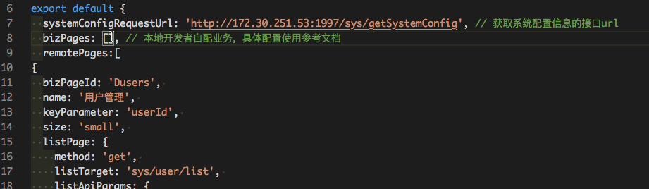

# thor-snippets

A vscode snippets plugin for **Thor**.

## Features

Common used Thor snippets, includes:

* Page Object
* Filters
* Actions
* Fields
* Table Fields
* Options(Select & Cascader)

## Requirements

n/a

## Extension Settings

n/a

## Known Issues

n/a

## Release Notes

Support link type table field and label type editpage field.

### 0.4.2 (2020-09-24)

1. add `Thor - TableFields - Link` support
2. add `Thor - Fields - Label` support

### 0.4.1 (2020-09-11)

1. revise `Thor - Page Object`, remove optional items
2. add `Thor - Actions - Custom Action` support

### 0.4.0 (2020-09-07)

1. add `Thor - Fields - Radio` support
2. add `Thor - Fields - Switch` support

### 0.3.0 (2020-09-04)

1. `Thor - Page Object` supports api params config, tree table config
2. add `Thor - Actions - BatchActions` support
3. add `Thor - TableFields - Image`
4. add `Thor - TableFields - Tag`

### 0.2.0 (2020-08-07)

1. add `Thor - Filters - Local Options Cascader`
2. add `Thor - Filters - Lazy Options Cascader`
3. add `Thor - Fields - Cascader`
4. add `Thor - Cascader Options`
5. change `Thor - Select Options`

### 0.1.0 (2020-07-10)

The very early access of Thor snippets

-----------------------------------------------------------------------------------------------------------

